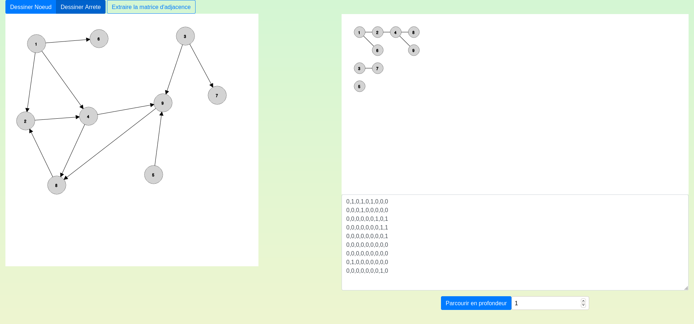

# Graph_Drawer_JS

Application de tracer de graphe et de parcours en profondeur réalisé en Javascript

Vous pouvez l'utiliser ici https://duffscs.github.io/Graph_Drawer_JS/

## Contexte :

Je me suis inspiré de mon projet parcours en profondeur. J'ai donc ajouté la posibilité de tracer le graphe et d'en extraire la matrice.
À la base ce programme était réalisé en Java-FX mais j'ai décidé de le merge en Javascript pour le rendre accessible à tous

## Réalisation :

Dans ce repository vous retrouverez le code de l'application. 
Bien évidement celle-ci est réalisé en Programmation Orientée Objet donc en utilisant les Javascript Class.

## Contributeur :
- https://github.com/Duffscs
